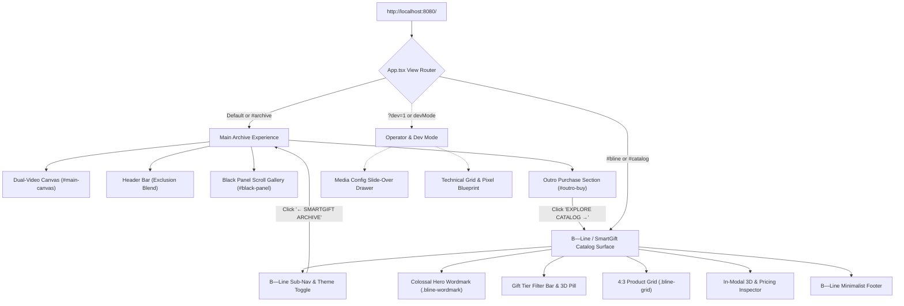

# SITEMAP & ROUTE ARCHITECTURE REGISTRY
**Project:** SmartGift Web UI (`web-ui-smg`)  
**Base URL:** `http://localhost:8080/`  
**Version:** `1.3.0`  
**Last Updated:** 2026-09-07  

---

## 1. High-Level Site Hierarchy



---

## 2. Route & State Registry

| Route / Hash | View State | Surface Name | Component | Access | Description |
|---|---|---|---|---|---|
| `http://localhost:8080/` | `currentView === 'archive'` | **Archive Showcase** | `<App />` | Public | Fullscreen dual-video canvas with mouse cursor scrubbing timeline and GSAP ScrollTrigger pinned archive lookbook gallery. |
| `http://localhost:8080/#bline` | `currentView === 'catalog'` | **B—Line / SmartGift Catalog** | `<BLineCatalogSection />` | Public | 100% faithful B—Line layout with Light/Dark theme switching, colossal wordmark, 27 products mapped across 5 Gift Tiers. |
| `http://localhost:8080/#catalog` | `currentView === 'catalog'` | **B—Line / SmartGift Catalog** | `<BLineCatalogSection />` | Public | Semantic alias for `/#bline`. |
| `http://localhost:8080/#archive` | `currentView === 'archive'` | **Archive Showcase** | `<App />` | Public | Explicit anchor navigating back to the archive lookbook. |
| `?dev=1` (Query Param) | `devMode === true` | **Operator Tools Enabled** | `<MediaConfigModal />` + `<ResolutionOverlay />` | Operator | Enables `[ ⚙️ MEDIA CONFIG ]` drawer button and `[ 📐 GRID OVERLAY ]` blueprint toggle button in the header. |

---

## 3. Surface & Component Inventory

### 3.1 Surface 1: Archive Experience (`/` or `#archive`)
- **Container Selector:** `#scroll-spacer`, `.page-root`
- **Cursor Affordance:** Custom circular blend-mode cursor (`.cursor` with `↗`).
- **Sub-components:**
  - **Dual-Video Canvas (`#main-canvas`)**:
    - `videoLeft`: Plays on right-hemisphere mouse scrub.
    - `videoRight`: Plays on left-hemisphere mouse scrub.
    - Center deadzone: $\pm 5\%$ window width.
  - **Brand Mark (`.logo`)**: Fixed top-left logo (`/logo-smg.jpg`).
  - **Exclusion Navigation (`<header>`)**:
    - Button `ARCHIVE`: Keeps user on archive page.
    - Button `B—LINE CATALOG`: Smoothly transitions to `currentView = 'catalog'`.
    - Tools: Dev mode triggers (`[ 📐 GRID OVERLAY ]`, `[ ⚙️ MEDIA CONFIG ]`).
  - **Outro CTA (`#outro-buy`)**:
    - Colossal pill CTA reading `EXPLORE CATALOG →`. Click triggers transition to B—Line catalog.

---

### 3.2 Surface 2: B—Line / SmartGift Catalog (`/#bline` or `/#catalog`)
- **Container Selector:** `.bline-page-wrapper`, `.bline-section`
- **Isolation Guarantee:** Natural browser scroll (`overflow-y: auto`), default system pointer (`cursor: auto`).
- **Theme Modes:**
  - Dark Theme: `.dark-theme` (Background `#0a0a0a`, Card `rgba(255,255,255,0.03)`)
  - Light Theme: `.light-theme` (Background `#f8f8f8`, Card `rgba(0,0,0,0.02)`)
- **Header Navigation (`.bline-nav`)**:
  - `← SMARTGIFT ARCHIVE`: Returns to Archive view.
  - Brand subtitle: `B—LINE / SMARTGIFT`.
  - Tier Navigation Links: `All`, `Eco-Friendly`, `Classic Oriental`, `Novelty & Care`, `Smart Tech`, `Bespoke (B-Line)`.
  - Theme Toggle: `☀️ LIGHT` / `🌙 DARK`.
- **Hero Header (`.bline-hero`)**:
  - Signature font wordmark: `.bline-wordmark` (`SmartGift` or `B—Line` when viewing Bespoke tier).
- **Section Label Bar (`.bline-section-label`)**:
  - Divider text: `Prodotti / Gift Tiers — Catalogo Completo · XX items`.
  - Filter pills: Quick tier selector + `🌐 3D Digital Twin (9)` toggle.
- **Card Grid (`.bline-grid`)**:
  - Card Structure (`.bline-card`):
    - Image container: `.bline-card-img-wrap` (Strict **4:3 aspect ratio**).
    - 3D badge: `.bline-3d-tag` (Visible if product has interactive `.glb` model).
    - Meta row: Product title (`.bline-card-name`) and subtitle/designer/price (`.bline-card-designer`).
- **Product Detail Modal (`.bline-modal-card`)**:
  - **Left Media Column (`.bline-modal-img-container`)**:
    - 3D Digital Twin Viewer: Google `<model-viewer>` with 360° orbit, zoom, and auto-rotation.
    - Media Switcher Tabs: `[ 🌐 3D Orbit ]`, `[ 📷 Photo ]`, `[ 🏢 Client Showcase ]`.
    - Enterprise Brand Mockups: Real corporate production cases (Starbucks, One Bangkok, GMMTV, Iconsiam, True).
  - **Right Info & Pricing Column (`.bline-modal-info`)**:
    - Category tag: `.bline-modal-cat`.
    - Product title: `<h2>` (English) + `.bline-modal-th-name` (Thai).
    - Subtitle / Designer credit.
    - Full product description: `.bline-modal-desc`.
    - Technical specifications row: Dimensions ($L \times W \times H\text{ cm}$), Net Weight (kg), Production Lead Time.
    - B2B Volume Pricing Calculator:
      - Quantity Presets: `10`, `50`, `100`, `300`, `500`, `1000` pcs.
      - Real-time calculations: Unit Price (`฿xxx`), Estimated Total (`฿xxx,xxx`), and Bulk Discount badge (`-xx%`).
    - Action CTA: `REQUEST B2B SPECIFICATION & QUOTE`.
- **Footer (`.bline-footer`)**:
  - B—Line S.r.l. & SmartGift Corporate imprint, links, and copyright statement.

---

### 3.3 Surface 3: Operator & Developer Tools (`?dev=1`)
- **Media Configuration Modal (`<MediaConfigModal />`)**:
  - Slide-over right drawer (`.config-panel-container`).
  - Allows live URL replacement for Logo, `videoLeftUrl`, `videoRightUrl`, and 10 Gallery images.
  - Persisted in browser `localStorage` under `smg_media_config`.
- **Live Resolution Blueprint Overlay (`<ResolutionOverlay />`)**:
  - Displays technical blueprint grid lines.
  - Renders live floating bounding box dimensions ($W \times H\text{ px}$) over every active media slot.

---

## 4. Product & Gift Tier Mapping Matrix

| Gift Tier | Canonical Products | SKU / ID | Key Features & Form Factor | 3D Twin | Client Showcase |
|---|---|---|---|:---:|:---:|
| **🌿 Eco-Friendly** | Smart LED Vacuum Bottle 500ml | `PM-BOTTLE-LED` | Temp display lid, 304 stainless, 18-24h heat retention | ✅ | One Bangkok, Starbucks |
| | Double Wall Stainless Coffee Mug 380ml | `PM-CFMUG` | Leak-proof lid, ergonomic handle, insulated | ✅ | Starbucks |
| | Ceramic Coffee Tumbler with Lid 450ml | `PM-TMB` | Matte ceramic body, splash-proof slider | ✅ | Starbucks, True |
| | Organic Cotton Canvas Tote Bag | `PM-CANVAS` | Heavyweight 14oz organic cotton, reinforced straps | ❌ | One Bangkok |
| **🏮 Classic Oriental** | Imperial Ceramic Tea Infuser Set | `PM-TEA-SET` | Celadon glazed ceramic, precision infuser, gift box | ❌ | Corporate VIP |
| | Mulberry Paper & Bamboo Folding Fan | `PM-SILK-FAN` | Handcrafted Thai mulberry paper, natural bamboo ribs | ❌ | Cultural Gift |
| | Artisanal Ceramic Incense Burner | `PM-INCENSE` | Lotus petal motif, brass censer fitting | ❌ | Wellness & Spa |
| | Hand-Carved Teakwood Keepsake Box | `PM-WOOD-BOX` | FSC-certified plantation teak, brass latch | ❌ | Executive Gift |
| **🕯️ Novelty & Care** | Ultrasonic Aroma Mist Diffuser | `PM-DIFFUSER` | 300ml tank, whisper-quiet ultrasonic, warm ambient LED | ❌ | Home & Office |
| | Hand-Poured Botanical Soy Wax Candle | `PM-CANDLE` | 100% natural soy wax, essential oil aromatherapy | ❌ | Hospitality |
| | Electric Shiatsu Neck Massager | `PM-MSG` | Ergonomic memory foam, 3-speed kneading, Type-C | ✅ | Wellness Gift |
| | Pure Mulberry Silk Contoured Eye Mask | `PM-SLEEP-SET` | 100% 22-momme Grade 6A mulberry silk | ❌ | Travel Set |
| **⚡ Smart Tech** | 10,000mAh Magnetic Power Bank | `PM-PB10K` | 15W Qi wireless, 20W PD Type-C, aluminum casing | ✅ | True, One31 |
| | High-Speed USB 3.2 Flash Drive 64GB | `PM-FLASH` | Zinc alloy unibody, read up to 130MB/s, laser logo | ✅ | GMMTV |
| | Smart Thermostatic Mug + Wireless Warmer | `PM-MUG-HEAT` | Constant 55°C beverage warmer + 15W Qi phone charger | ✅ | Executive Gift |
| | Hardcover Executive Notebook & Pen Set | `PM-NB` | Premium PU leather, 100gsm acid-free paper, metal pen | ✅ | GMMTV |
| | Automatic Inverted Windproof Umbrella | `PM-UMB` | Reverse folding, Teflon coating, fiberglass ribs | ✅ | Iconsiam |
| **✨ Bespoke (B-Line)** | Boby Storage Unit | `boby` | Joe Colombo (1970) · Iconic ABS mobile storage tower | ❌ | Museum Classic |
| | Spinny Drawer Unit | `spinny` | Marc Sadler (2003) · Rotating cantilever drawers | ❌ | Architectural Piece |
| | Ring Container | `ring` | Marc Sadler (2005) · Modular container system | ❌ | Modernist Object |
| | Linea Stool | `linea` | Marc Newson (2012) · Sculptural minimalist stool | ❌ | Iconic Seating |
| | Arco Floor Lamp | `arco` | Michele De Lucchi (2015) · Minimalist arc lighting | ❌ | Bauhaus Inspired |
| | Polo Stool | `polo` | Alberto Meda (2018) · Precision die-cast aluminum stool | ❌ | Industrial Design |
| | Cento Chair | `cento` | Jasper Morrison (2019) · Pure monolithic lounge chair | ❌ | Contemporary Masterpiece |
| | Orbita Table Lamp | `orbita` | Ferruccio Laviani (2020) · Reflected ambient light sphere | ❌ | Lighting Design |
| | Kilo Low Table | `kilo` | Stefan Diez (2021) · Powder-coated sheet steel table | ❌ | Minimalist Table |
| | Uno Chair | `uno` | Ronan Bouroullec (2022) · Organic bentwood chair | ❌ | Scandinavian Minimal |
| | Nova Desk Lamp | `nova` | Patricia Urquiola (2023) · Directional LED task lamp | ❌ | Milan Design Week |

---

## 5. File & Asset Dependency Graph

```
public/
├── assets/
│   └── smartgift/
│       ├── 3d/
│       │   ├── PM-BOTTLE-LED.glb
│       │   ├── PM-CFMUG.glb
│       │   ├── PM-FLASH.glb
│       │   ├── PM-MSG.glb
│       │   ├── PM-MUG-HEAT.glb
│       │   ├── PM-NB.glb
│       │   ├── PM-PB10K.glb
│       │   ├── PM-TMB.glb
│       │   └── PM-UMB.glb
│       ├── mockups/
│       │   ├── ob_bottle.jpg / sbux_bottle.jpg
│       │   ├── sbux_mug.jpg
│       │   ├── sbux_tmb.jpg / gmmtv_tmb.jpg / one31_tmb.jpg
│       │   ├── true_pb.jpg / one31_pb.jpg
│       │   ├── gmm_flash.jpg
│       │   ├── gmm_notebook.jpg
│       │   └── iconsiam_umb.jpg
│       └── plates/
│           ├── ob_bottle_plate.png
│           ├── sbux_mug_plate.png
│           ├── sbux_tumbler_plate.png
│           ├── tea_set_plate.png
│           └── ... (16 Product Plates)
└── logo-smg.jpg
```
