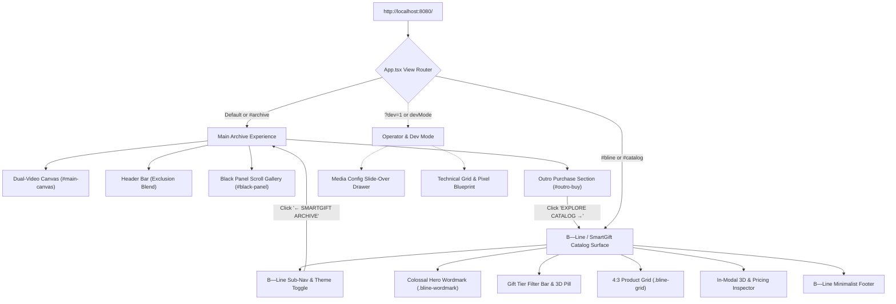

# SITEMAP & ROUTE ARCHITECTURE REGISTRY
**Project:** SmartGift Web UI (`web-ui-smg`)  
**Base URL:** `http://localhost:8080/`  
**Version:** `1.3.0`  
**Last Updated:** 2026-09-07  

---

## 1. High-Level Site Hierarchy



---

## 2. Route & State Registry

| Route / Hash | View State | Surface Name | Component | Access | Description |
|---|---|---|---|---|---|
| `http://localhost:8080/` | `currentView === 'archive'` | **Archive Showcase** | `<App />` | Public | Fullscreen dual-video canvas with mouse cursor scrubbing timeline and GSAP ScrollTrigger pinned archive lookbook gallery. |
| `http://localhost:8080/#bline` | `currentView === 'catalog'` | **B—Line collection** | `<BLineCatalogSection />` | Public | 12 B—Line S.r.l. design pieces as a partner collection / Bespoke inspiration, labelled "SmartGift × B—Line · Italian design collection" and marked as not SmartGift products; wordmark reads B—Line. |
| `http://localhost:8080/#catalog` | `currentView === 'catalog'` | **SmartGift Catalog — Lens A (เริ่มจากผู้รับ)** | `<BLineCatalogSection />` | Public | Gifting brief (`?recipient=TEAM&occasion=new-year&tier=select&qty=100`) → recommended sets → singles by theme; `#catalog/theme/<slug>`, `#catalog/tier/<tier>`, `#catalog/occasion/<slug>`, `#catalog/kind/single|set`. Brief answers ride along into item deep links. |
| `http://localhost:8080/#catalog/category` | `currentView === 'catalog'` | **SmartGift Catalog — Lens B (หมวดหมู่สินค้า)** | `<BLineCatalogSection />` | Public | Standard-category index; `#catalog/category/<L1>` and `#catalog/category/<L1>/<family>`; `?view=list` spec table; `?supplier=1` adds the supplier layer; `?q=` searches codes, names, families, aliases and colors. |
| `http://localhost:8080/#catalog/item/<code>` | `currentView === 'catalog'` | **Item deep link** | `<BLineCatalogSection />` | Public | Opens the detail modal for a PM / set / supplier code; closing returns to the list route. |
| `http://localhost:8080/#catalog/bundle` | `currentView === 'catalog'` | **Bundle builder** | `<BundleBuilder />` | Public | Multi-tier package from core sets; `#catalog/bundle/<PKG-code>` prefills a template; groups travel in `?g=tier:set:qty|…`; submits via `<BriefSubmitPanel />`. |
| `http://localhost:8080/#archive` | `currentView === 'archive'` | **Archive Showcase** | `<App />` | Public | Explicit anchor navigating back to the archive lookbook. |
| `?dev=1` (Query Param) | `devMode === true` | **Operator Tools Enabled** | `<MediaConfigModal />` + `<ResolutionOverlay />` | Operator | Enables `[ ⚙️ MEDIA CONFIG ]` drawer button and `[ 📐 GRID OVERLAY ]` blueprint toggle button in the header. |

---

## 3. Surface & Component Inventory

### 3.1 Surface 1: Archive Experience (`/` or `#archive`)
- **Container Selector:** `#scroll-spacer`, `.page-root`
- **Cursor Affordance:** Custom circular blend-mode cursor (`.cursor` with `↗`).
- **Sub-components:**
  - **Dual-Video Canvas (`#main-canvas`)**:
    - `videoLeft`: Plays on right-hemisphere mouse scrub.
    - `videoRight`: Plays on left-hemisphere mouse scrub.
    - Center deadzone: $\pm 5\%$ window width.
  - **Brand Mark (`.logo`)**: Fixed top-left logo (`/logo-smg.jpg`).
  - **Ledger (`#outro-info`)**: total items for sale computed from the item pool (core singles + core sets + supplier layer) — replaced the template's fake "5,500 ฿".
  - **Exclusion Navigation (`<header>`)**:
    - Button `ARCHIVE`: Keeps user on archive page.
    - Button `B—LINE CATALOG`: Smoothly transitions to `currentView = 'catalog'`.
    - Tools: Dev mode triggers (`[ 📐 GRID OVERLAY ]`, `[ ⚙️ MEDIA CONFIG ]`).
  - **Outro CTA (`#outro-buy`)**:
    - Colossal pill CTA reading `EXPLORE CATALOG →`. Click triggers transition to B—Line catalog.

---

### 3.2 Surface 2: B—Line / SmartGift Catalog (`/#bline` or `/#catalog`)
- **Container Selector:** `.bline-page-wrapper`, `.bline-section`
- **Isolation Guarantee:** Natural browser scroll (`overflow-y: auto`), default system pointer (`cursor: auto`).
- **Theme Modes:**
  - Dark Theme: `.dark-theme` (Background `#0a0a0a`, Card `rgba(255,255,255,0.03)`)
  - Light Theme: `.light-theme` (Background `#f8f8f8`, Card `rgba(0,0,0,0.02)`)
- **Header Navigation (`.bline-nav`)**:
  - `← SMARTGIFT ARCHIVE`: Returns to Archive view.
  - Brand subtitle: `B—LINE / SMARTGIFT`.
  - Tier Navigation Links: `All`, `Eco-Friendly`, `Classic Oriental`, `Novelty & Care`, `Smart Tech`, `Bespoke (B-Line)`.
  - Theme Toggle: `☀️ LIGHT` / `🌙 DARK`.
- **Hero Header (`.bline-hero`)**:
  - Signature font wordmark: `.bline-wordmark` (`SmartGift` or `B—Line` when viewing Bespoke tier).
- **Section Label Bar (`.bline-section-label`)**:
  - Divider text: `Prodotti / Gift Tiers — Catalogo Completo · XX items`.
  - Filter pills: Quick tier selector + `🌐 3D Digital Twin (9)` toggle.
- **Card Grid (`.bline-grid`)**:
  - Card Structure (`.bline-card`):
    - Image container: `.bline-card-img-wrap` (Strict **4:3 aspect ratio**).
    - 3D badge: `.bline-3d-tag` (Visible if product has interactive `.glb` model).
    - Meta row: Product title (`.bline-card-name`) and subtitle/designer/price (`.bline-card-designer`).
- **Product Detail Modal (`.bline-modal-card`)**:
  - **Left Media Column (`.bline-modal-img-container`)**:
    - 3D Digital Twin Viewer: Google `<model-viewer>` with 360° orbit, zoom, and auto-rotation.
    - Media Switcher Tabs: `[ 🌐 3D Orbit ]`, `[ 📷 Photo ]`, `[ 🏢 Client Showcase ]`.
    - Enterprise Brand Mockups: Real corporate production cases (Starbucks, One Bangkok, GMMTV, Iconsiam, True).
  - **Right Info & Pricing Column (`.bline-modal-info`)**:
    - Category tag: `.bline-modal-cat`.
    - Product title: `<h2>` (English) + `.bline-modal-th-name` (Thai).
    - Subtitle / Designer credit.
    - Full product description: `.bline-modal-desc`.
    - Technical specifications row: Dimensions ($L \times W \times H\text{ cm}$), Net Weight (kg), Production Lead Time.
    - B2B Volume Pricing Calculator:
      - Quantity Presets: `10`, `50`, `100`, `300`, `500`, `1000` pcs.
      - Real-time calculations: Unit Price (`฿xxx`), Estimated Total (`฿xxx,xxx`), and Bulk Discount badge (`-xx%`).
    - Action CTA: `REQUEST B2B SPECIFICATION & QUOTE`.
- **Footer (`.bline-footer`)**:
  - B—Line S.r.l. & SmartGift Corporate imprint, links, and copyright statement.

---

### 3.3 Surface 3: Operator & Developer Tools (`?dev=1`)
- **Media Configuration Modal (`<MediaConfigModal />`)**:
  - Slide-over right drawer (`.config-panel-container`).
  - Allows live URL replacement for Logo, `videoLeftUrl`, `videoRightUrl`, and 10 Gallery images.
  - Persisted in browser `localStorage` under `smg_media_config`.
- **Live Resolution Blueprint Overlay (`<ResolutionOverlay />`)**:
  - Displays technical blueprint grid lines.
  - Renders live floating bounding box dimensions ($W \times H\text{ px}$) over every active media slot.

---

## 4. Catalog Item Pool (generated from the SSOT)

The product list is no longer maintained in this document. It is generated by `npm run build:catalog` from `business-01-smart-gift/data-pipeline/02_prepared/` into `src/data/catalogItems.generated.ts` (core: 16 PM singles + 6 sets) and `public/catalog/data/supplier-items.json` (216 public-eligible supplier offers). Structure, categories and routes: [`docs/CATALOG-STRUCTURE-SPEC.md`](CATALOG-STRUCTURE-SPEC.md).

| Layer | Items | Where | Shown |
|---|---|---|---|
| core | 16 singles + 6 sets | `catalogItems.generated.ts` + `coreMedia.ts` | always |
| supplier | 216 of 1,110 offers | `public/catalog/data/supplier-items.json` | behind the "แคตตาล็อกผู้ผลิต" pill |
| partner | 12 B—Line pieces | `unifiedBLineCatalog.ts` | `#bline` only |

---

## 5. File & Asset Dependency Graph

```
public/
├── assets/
│   └── smartgift/
│       ├── 3d/
│       │   ├── PM-BOTTLE-LED.glb
│       │   ├── PM-CFMUG.glb
│       │   ├── PM-FLASH.glb
│       │   ├── PM-MSG.glb
│       │   ├── PM-MUG-HEAT.glb
│       │   ├── PM-NB.glb
│       │   ├── PM-PB10K.glb
│       │   ├── PM-TMB.glb
│       │   └── PM-UMB.glb
│       ├── mockups/
│       │   ├── ob_bottle.jpg / sbux_bottle.jpg
│       │   ├── sbux_mug.jpg
│       │   ├── sbux_tmb.jpg / gmmtv_tmb.jpg / one31_tmb.jpg
│       │   ├── true_pb.jpg / one31_pb.jpg
│       │   ├── gmm_flash.jpg
│       │   ├── gmm_notebook.jpg
│       │   └── iconsiam_umb.jpg
│       └── plates/
│           ├── ob_bottle_plate.png
│           ├── sbux_mug_plate.png
│           ├── sbux_tumbler_plate.png
│           ├── tea_set_plate.png
│           └── ... (16 Product Plates)
└── logo-smg.jpg
```
